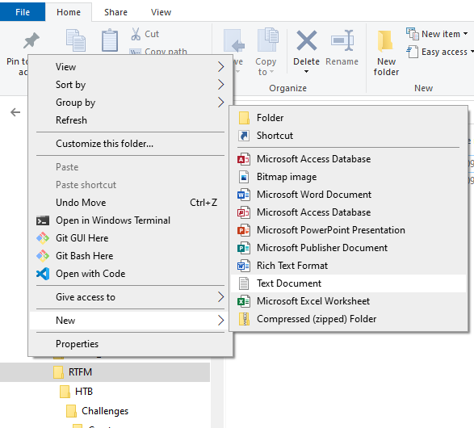
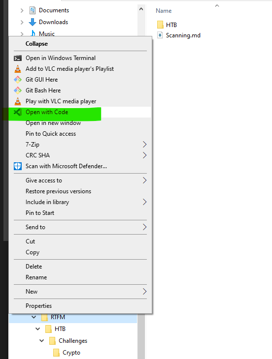
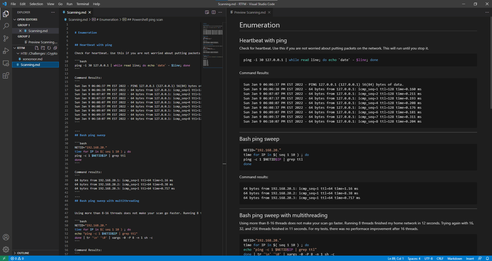
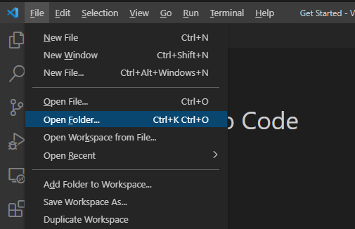

# Build Your Own RTFM

Red Team Field Manual / Read the f***ing Manual

 
## Red Team Field Manual
---
There is a book, [RTFM](https://www.amazon.com/Rtfm-Red-Team-Field-Manual/dp/1494295504/), that is a fantastic resource for people in cyber security. Get it, it is worth the $10. There is also a [Blue Team Field Manual](https://www.amazon.com/Blue-Team-Field-Manual-BTFM/dp/154101636X/) for $15 on Amazon. 

 
## Why build your own RTFM?
---

There is no one like you! You want to build an RTFM to be a quick and concise place for you to look for code and technique examples based on your specific work roles and work history. You also want to spend the time building your own list because it will help you learn.

As you complete your daily tasks or compete in online hacking challenges, add examples of useful code or techniques in your RTFM. Copy code and add verbose comments that can easily be found with a Ctrl-F in the future.

Sometimes you will hear this document called “pastables” because the idea is that you will search through it for code that you can copy/paste. 

 
## To Cloud or Not To Cloud

If you have easy and consistent access to an internet connection, tools like OneNote will allow to you find and update your notes from anywhere. If you work in a space where you can not or should not touch the internet, you will want another solution like CherryTree or a code editor.

[Here](https://youtu.be/dX0IVDPo7ek?t=76) is video explaining why it is good to keep good notes. The guy in the video prefers using OneNote. At [3:50](https://youtu.be/dX0IVDPo7ek?t=231) he shares his screen and show a very well organized set of notes. Steal some ideas from this guy.

If you expect to use local files or wont have access to online resources, try another choice like VS Code or CherryTree.

 
## VS Code

To confuse myself, I use a both VS Code and CherryTree to keep my notes. 

This is a terse explanation of how to get going with VS Code:
- In Windows Explorer or other file manager, make a folder for your notes
- Right Click and create some empty text docs and rename them with a *.md extension
    - Create files such as scanning.md, tunneling.md, reverse_shells.md, PrivEsc_Win.md
- Create subfolders with more documents if needed
- From Windows Explorer, right click on your root folder and choose Open With Code

 

### Create Folder Structure and Add Empty Files

 &nbsp;&nbsp;&nbsp;&nbsp;&nbsp;&nbsp;

### Right-Click on folder and Open with Code

 &nbsp;&nbsp;&nbsp;&nbsp;&nbsp;&nbsp;

### Capture your notes.

This example shows the use of Markdown to create formatting. Using Markdown is not necessary but it really helps readability.

 &nbsp;&nbsp;&nbsp;&nbsp;&nbsp;&nbsp;

### Open folder from an already open Code window.

If you already have a VS Code window open, you can import all of your pages by going to the File Menu and choosing Open Folder.

 &nbsp;&nbsp;&nbsp;&nbsp;&nbsp;&nbsp;

 
## Read the F**king Manual rant
---

A good mentor will not tell you to go RTFM or #TryHarder. Unfortunately, you will encounter these people and it hurts everyone. You lose out of being enriched by their knowledge and they lose out on rethinking through problems and supporting the next generation of leaders.

With that said, if you are searching for help on a difficult or new-to-you task and haven't done some basic research or troubleshooting, the person whose time you are about to waste should quickly and politely send you on your way.

Use this approach for your new-to-you task:
- try and clearly define what you think your problem is
- search online for solutions to your problem
- try some of those solutions by yourself
- find a mentor and discuss the steps you taken to get solve your problem.

If you have good mentors in your life, this is a good method for getting attention from them. Because we all have limited time, show your mentor that you are someone who is worth investing in.

 
## Resources
---

Download Visual Studio Code 
[https://code.visualstudio.com/Download](https://code.visualstudio.com/Download)

Download CherryTree 
[https://www.giuspen.com/cherrytree/](https://www.giuspen.com/cherrytree/)

Youtube Search for "CherryTree OSCP" 
[https://www.youtube.com/results?search_query=cherrytree+oscp](https://www.youtube.com/results?search_query=cherrytree+oscp)

Reddit discussion about note taking for OSCP 
[https://www.reddit.com/r/oscp/comments/9gjzc8/help_oscp_note_taking/](https://www.reddit.com/r/oscp/comments/9gjzc8/help_oscp_note_taking/)

High On Coffee OSCP Resources 
[https://highon.coffee/](https://highon.coffee/)

HackTricks. Lots of code examples to copy over. 
[https://book.hacktricks.xyz/windows/basic-cmd-for-pentesters](https://book.hacktricks.xyz/windows/basic-cmd-for-pentesters)

